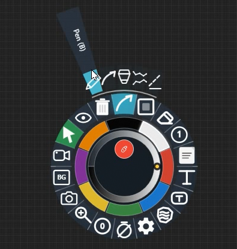
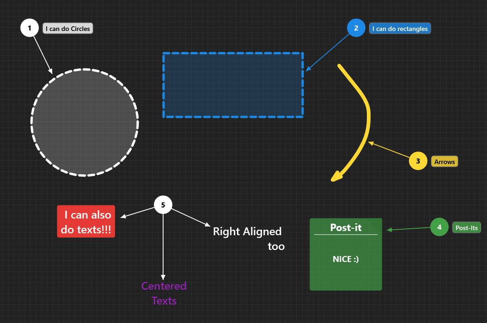
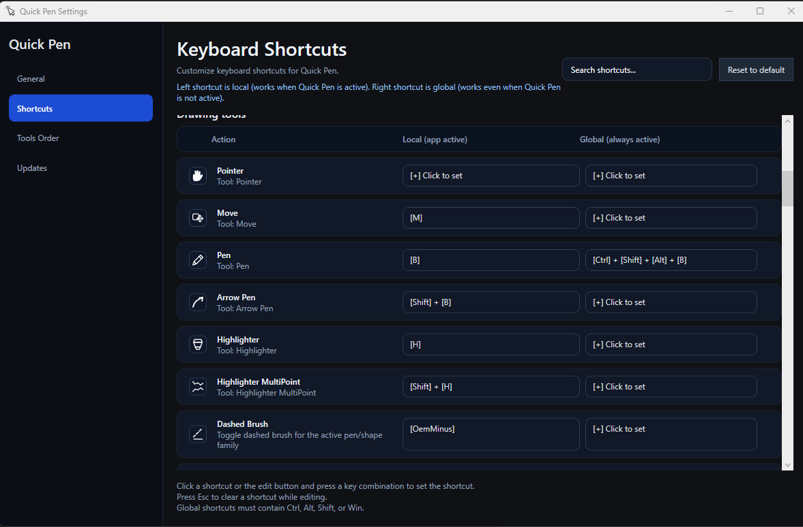

# Quick Pen

Quick Pen is a lightweight Windows annotation tool for screen-first workflows: demos, tutorials, support calls, visual reviews, and quick documentation.

It runs from the system tray and gives instant access to a radial tool menu over the desktop, so you can draw, highlight, label, capture, freeze, and explain without leaving the current app.

[Download the latest version](https://github.com/hugouchoasborges/quick-pen-releases/releases/latest/download/QuickPen-Setup.zip)

## Preview

## What It Does

- Draw directly on top of the desktop with pen, arrow pen, highlighter, and shapes.
- Add text labels, numbered counters, arrows, filled shapes, and multipoint annotations.
- Use focus tools such as blur, spotlight, mask, and snapshot regions.
- Capture screenshots, videos, and GIFs from selected screen areas.
- Freeze the screen for stable presentation and explanation flows.
- Switch tools quickly through a radial menu designed for fast mouse-driven access.
- Keep the app tray-first and lightweight for daily use.

## Why It Exists

Quick Pen was built as a practical desktop productivity tool for moments when explaining visually is faster than writing instructions. It is designed for low-friction annotation during meetings, bug reports, product demos, and technical support.

The project also demonstrates Windows desktop engineering with WPF, native input handling, overlay rendering, persistent tool preferences, release automation, and a compact installer distribution flow.

## Core Features

- **Radial menu:** fast access to drawing, text, focus, capture, freeze, zoom, and utility actions.
- **Drawing tools:** pen, arrow pen, highlighter, rectangles, circles, lines, arrows, and multipoint shapes.
- **Text tools:** inline editable text and label text with alignment, color, resize, move, delete, undo, and redo support.
- **Focus tools:** blur, spotlight, mask, snapshot, and clear-focus workflows.
- **Capture tools:** screenshot, video, and GIF capture with saved selections and floating controls.
- **Screen freeze:** lock the current monitor background while keeping annotations editable above it.
- **Undo/redo:** operation-based history for supported drawing and object workflows.
- **Preferences:** tool styles, sizes, opacity, brightness, and related settings persist locally.

## Platform

- Windows desktop
- WPF / .NET
- Tray-first workflow
- Overlay-based interaction model

## Download

Use the direct latest-release package:

[https://github.com/hugouchoasborges/quick-pen-releases/releases/latest/download/QuickPen-Setup.zip](https://github.com/hugouchoasborges/quick-pen-releases/releases/latest/download/QuickPen-Setup.zip)

## Portfolio Notes

This project focuses on practical desktop UX, low-latency screen overlays, native Windows integration, and incremental feature delivery. The main design constraint is keeping the tool predictable and lightweight while still supporting rich annotation workflows.