# QuickPen User Manual

## 1. Overview
QuickPen is a tray-first Windows desktop app that places a transparent overlay over your screen so you can draw, highlight, annotate, mark and capture content without leaving your current workflow. It is built for demonstrations, support sessions, tutorials and visual documentation.

Core ideas:
- **Tray-first:** QuickPen lives in the system tray. The main window only opens when you need it; the overlay opens on demand.
- **Radial-menu workflow:** every tool is reachable from a radial menu opened with `Ctrl Ctrl` (double Ctrl), placed at your cursor.
- **Local-first:** preferences and captures stay on your machine. No accounts required for Free features.

## 2. Getting Started
### 2.1 Install
Download the latest `QuickPen-Setup.exe` from the [releases page](https://github.com/hugouchoasborges/quick-pen-releases/releases/latest) and run it. The installer closes any running `QuickPen.exe`, replaces the files and relaunches the new version.

### 2.2 First run
On first launch QuickPen registers a tray icon and, if enabled in `Settings > General`, places a `QuickPen.lnk` shortcut in your Windows startup folder so the app is ready every session.

### 2.3 Opening the overlay
- Double-press `Ctrl` (the second press must happen within ~300ms). The radial menu opens at the mouse position.
- Or click the minimalist side launcher docked at the screen edge.
- Or right-click the tray icon and open the main window.

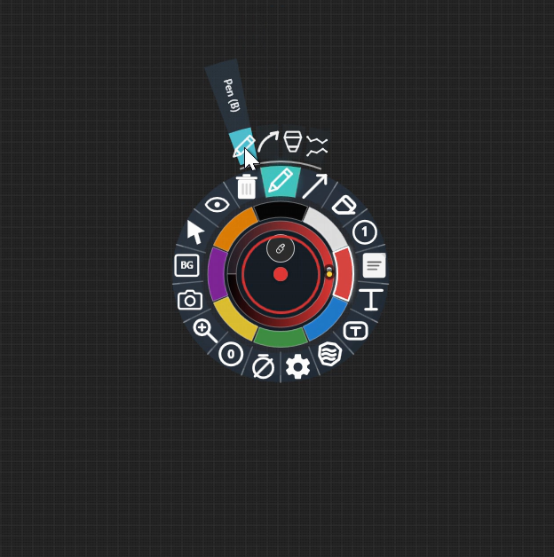

## 3. The Radial Menu
The radial menu groups every QuickPen action into sectors arranged around the cursor. Hovering a sector that has children expands the submenu; terminal items expand outward with a horizontal label that auto-rotates to stay readable.

### 3.1 Drawing sectors
- **Pen** — freehand stroke. `Shift+B` switches to Arrow Pen.
- **Highlighter** — semi-transparent strokes; preview respects the configured alpha. `Shift+H` switches to Highlighter MultiPoint.
- **Shapes** — Arrow, Line, Rectangle, Circle, with filled variants (`Shift+R`, `Shift+C`).
- **Text** — inline editable text on the overlay.
- **Label Text** — resizable label with 8 handles and multi-line editing (`Ctrl+Enter` / `Shift+Enter` insert new lines).
- **Counter** — auto-numbered counter with curved connector to a target point.
- **Post-it** — sticky note on the overlay.
- **Eraser** — removes drawables under the cursor.

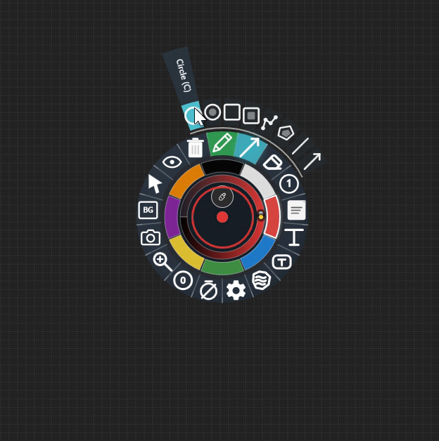

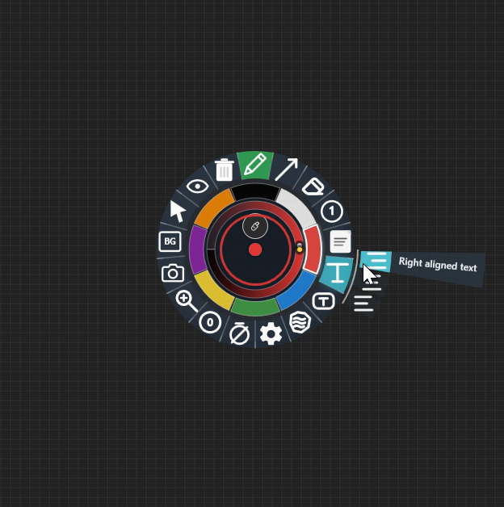

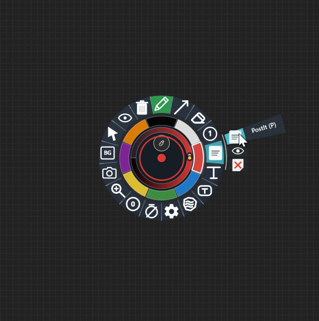

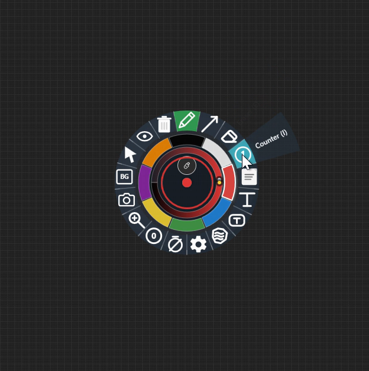

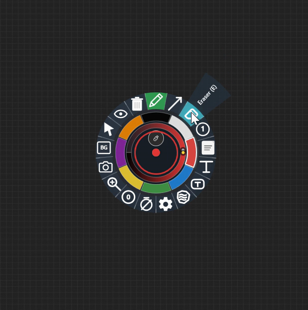

### 3.2 Focus and capture sectors
- **Blur** — blurs a rectangular region of the screen.
- **Mask** — solid mask used to hide sensitive content.
- **Spotlight / Pattern** — focus the audience on a region or apply a pattern background.
- **Snapshot** — freezes a region of the screen for annotation.
- **Printscreen / Video / GIF** — capture flow with selection slots and freeze (see section 6).
- **Zoom** — zoom into a chosen region of the screen.
- **Background** — dedicated background layer with Z-order control (Behind Apps, Between Apps, On Top).

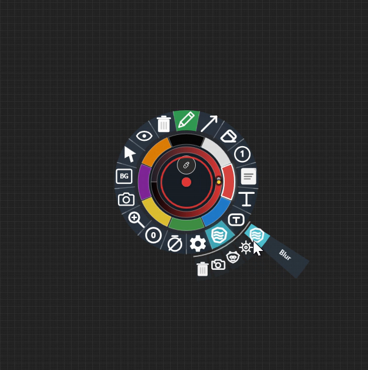

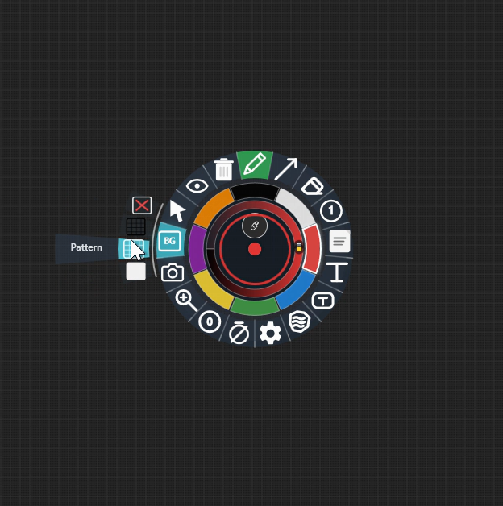

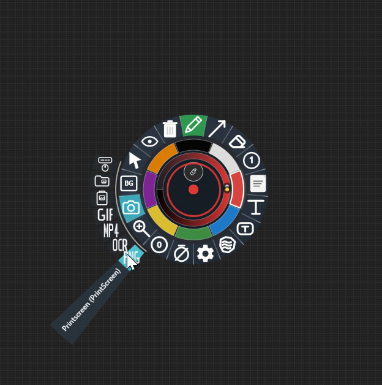

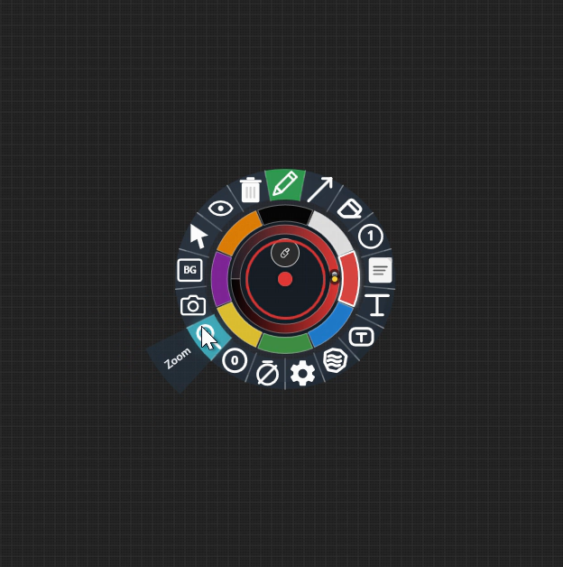

### 3.3 Utility sectors
- **Pointer** — pointer/idle mode; clicks pass through to apps below.
- **Visibility** — toggle the drawables visible/hidden.
- **Timer** — set lifetime timer for ephemeral strokes (`Off`, `1s`, `2s`, `3s`, `4s`, `5s`).
- **Slots** — switch between drawable slots.
- **Clear** — Clear All / Clear BG / Clear Post-Its (children appear only when applicable).
- **Settings** — open the QuickPen settings window.

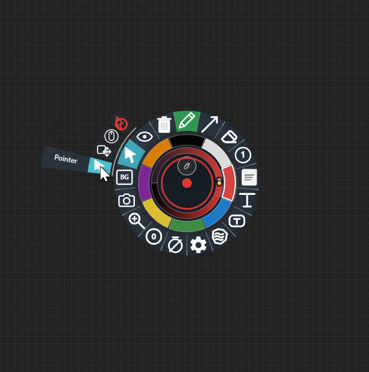

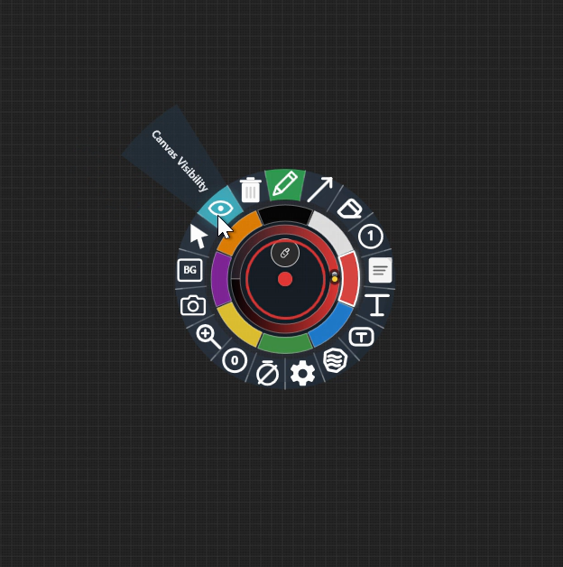

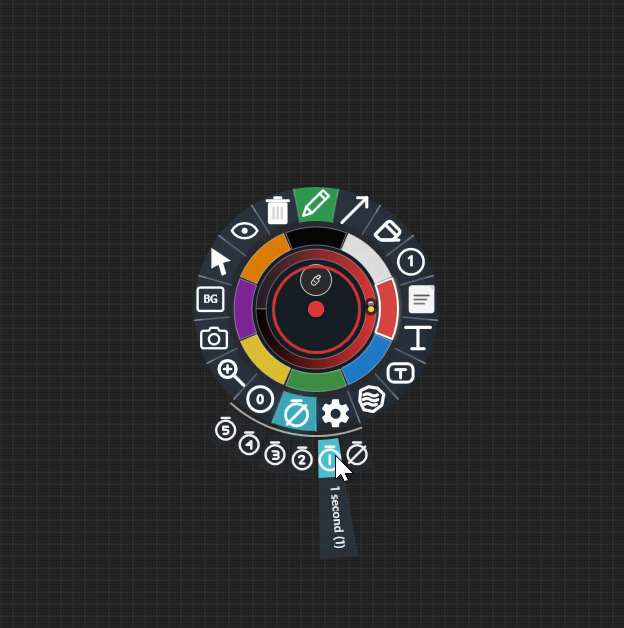

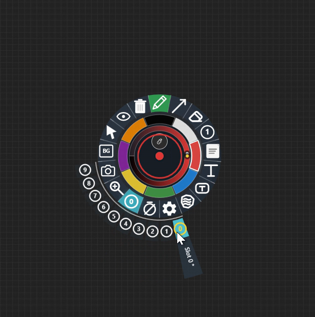

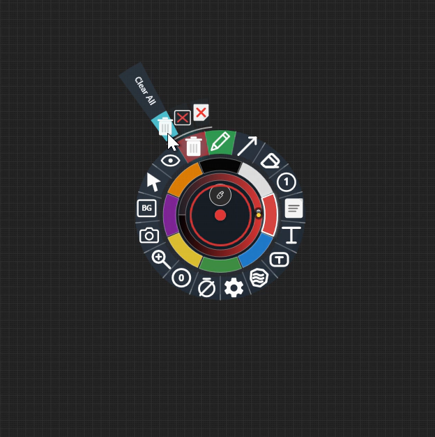

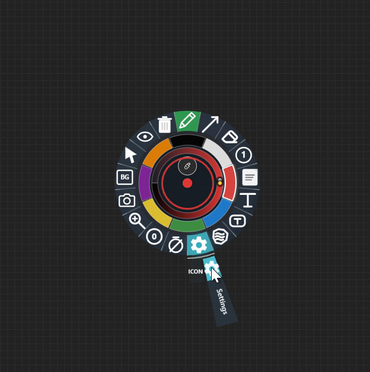

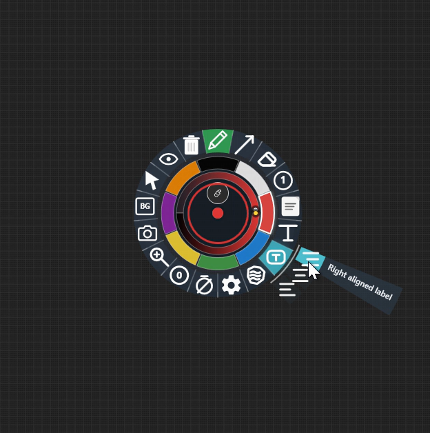

## 4. Drawing Tools
### 4.1 Pen and Arrow Pen
- `B` activates Pen, `Shift+B` activates Arrow Pen.
- Stroke is committed on mouse release using the final cursor position.

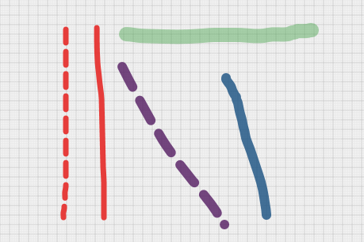

### 4.2 Highlighter and Highlighter MultiPoint
- `H` activates Highlighter, `Shift+H` activates Highlighter MultiPoint.
- Preview alpha matches the final stroke alpha so what you see while drawing is what you get.
- Highlighter MultiPoint uses solid geometric fill — no stripes or gaps after resize.

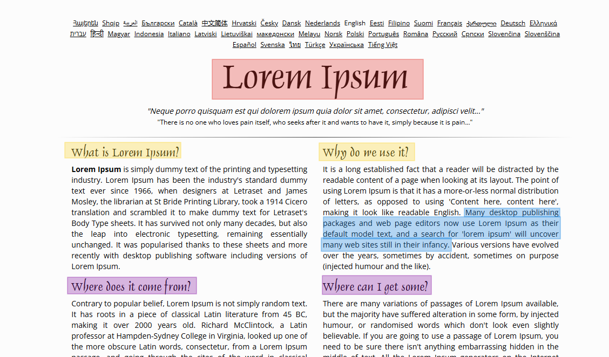

### 4.3 Shapes
- Outlined and filled rectangles (`R` / `Shift+R`), circles (`C` / `Shift+C`), arrows (`A`), and lines.
- Filled shapes rotate together with their fill.
- Selected shapes accept `Shift + Wheel` to change border thickness down to `0` (invisible border).
- Line and Arrow shapes support a single larger semi-transparent middle curve handle for quadratic Bezier curves, including dashed linear shapes.

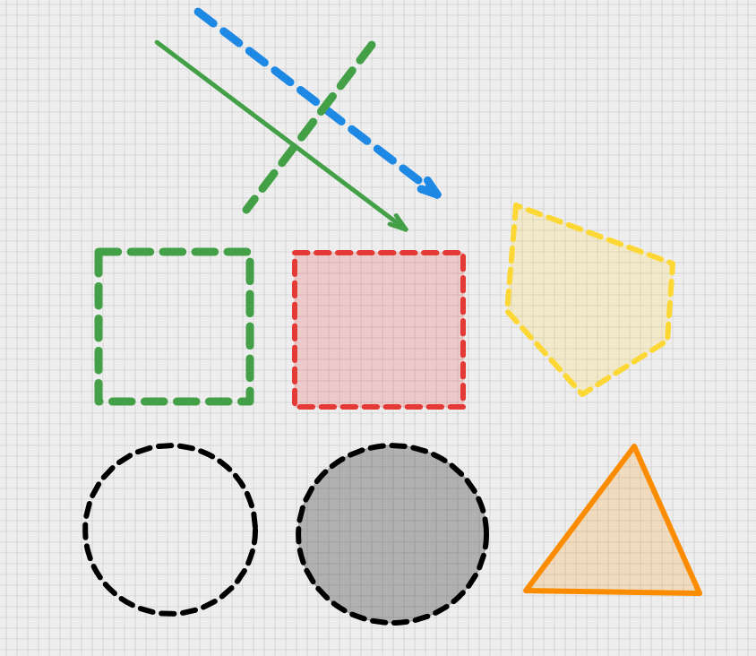

### 4.4 Text and Label Text
- `T` activates Text. `L` activates Label Text.
- `Ctrl+Enter` and `Shift+Enter` insert new lines; empty lines expand the editor immediately.
- Label Text resize handles: 4 corners + 4 sides; `Shift` mirrors the resize symmetrically.
- Label Text auto-sizes to the text content until the first manual resize.

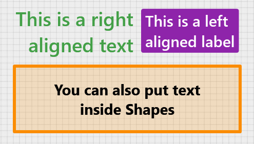

### 4.5 Counter and Post-it
- `I` activates Counter, `P` activates Post-it.
- Counter auto-numbers and supports editing; connector to the target point uses the same curve-control model as linear shapes.
- Counter accepts `Shift + Wheel` for individual resize (without `Shift`, wheel keeps the previous behavior).
- Post-it is a draggable note placed on the overlay; rotate via the handle and `Shift` to snap to 15°.

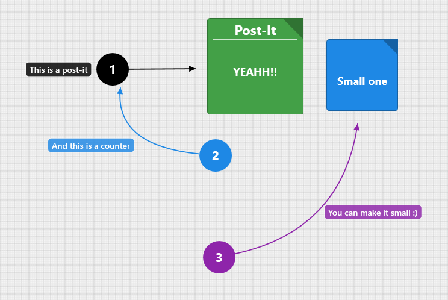

### 4.6 Eraser
- `E` activates the Eraser.
- Erases drawables under the cursor while pressed.

## 5. Focus Tools
The focus tools sit on a dedicated layer above the drawing layer.

- **Blur** masks a region with a configurable blur radius.
- **Spotlight** dims everything outside a circular region.
- **Mask** is a solid block useful to hide sensitive content during demos.
- **Snapshot** freezes a region of the screen so you can draw on top of a static copy.

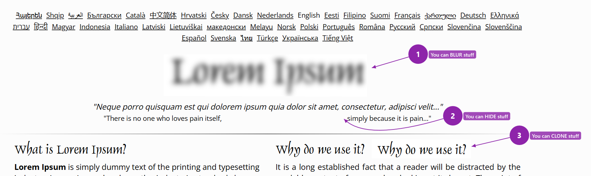

## 6. Capture: Printscreen, Video and GIF
QuickPen ships floating capture panels with collapse-by-handle (independent state for Screenshot, Video/GIF idle and Video/GIF recording).

### 6.1 Selection model
- Floating non-circular vertical wheel with up to 5 visible entries: `Free Selection` (default), `Last Selection` (when available), saved selections and `Save New Selection`.
- `Free Selection` shows a green highlight when active.
- `Save New Selection` opens an input that immediately receives focus; `Enter` saves and selects.
- The active saved selection shows a red `X` button to remove it.

### 6.2 Freeze
- Press the freeze toggle to lock the underlying frame while you adjust the selection.
- The main UI is suppressed during capture to avoid appearing in the frozen image.
- Freeze starts disabled by default at the beginning of each session.

### 6.3 Auto-Capture
- The Screenshot tool supports Auto-Capture with editable interval (typed or `+/-`), unit `sec`/`min`.
- During auto-capture the selection is locked, Freeze is effectively off and you can stop via the `X` submenu shortcut.
- Multi/Auto capture preserves the selection fade and keeps the tool background in the frame. Resize handles are hidden temporarily during each capture to keep them out of the image.

### 6.4 Action hierarchy
The capture control panel uses a primary/secondary/tertiary visual hierarchy so the most common action stands out.

## 7. Background Tool
A dedicated background layer separates from the drawing layer. Use the wheel on the Background tool to change Z-order:
- **Behind Apps** — sits behind every other window.
- **Between Apps** — between the active app and the rest of the desktop.
- **On Top** — above every window, like a true overlay background.

The radial sub-hit-test only includes visible suboptions (e.g. Background does not show a remove `X` when no background exists).

## 8. Selection, Move, Duplicate, Delete
- Use Pointer mode or `M` to move and select drawables.
- `Ctrl+D` duplicates the current selection.
- `Delete` removes the current selection.
- `Ctrl+Z` / `Ctrl+Y` undo and redo per operation (except in `Pointer`/`Idle`).
- Rotation handles are available for drawables, Text/Label and Post-it. Hold `Shift` to snap rotation to 15°.

## 9. The Side Launcher
QuickPen exposes a minimalist side launcher docked to the left or right edge of the active monitor.
- Glass-like premium visual: half-dock rounded shape, glow/soft shadow, hover-expanded circular actions, dashed accent on its own outline.
- Magnetic snap to the monitor edge.
- Passive state while you draw (does not interrupt the stroke).
- Per-monitor position memory (`monitor / side / yNormalized`).
- Hover proximity zone at the monitor edge for fast access.
- Drag visual: compact circular handle while moving; back to half-dock on release.
- Opening the radial from the launcher suspends ink/stylus capture momentarily to avoid blocking the click when Brush was active. A prolonged hover may also switch automatically to Pointer when safe.
- When the lifetime timer is active and an eligible tool is selected, the launcher shows a compact badge with the configured value (`1s/2s/3s/4s/5s`).

Tray actions allow hiding/showing the launcher icon and resetting its position.

## 10. Settings
Open Settings from the radial menu or the tray icon. Five tabs are available.

### 10.1 General
- **Start with Windows** — adds `QuickPen.lnk` to the Windows Startup folder.
- **Show Overlay Icon** — synchronized with the tray menu, controls the side launcher visibility.
- Theme, transparency, scale and other UI preferences.

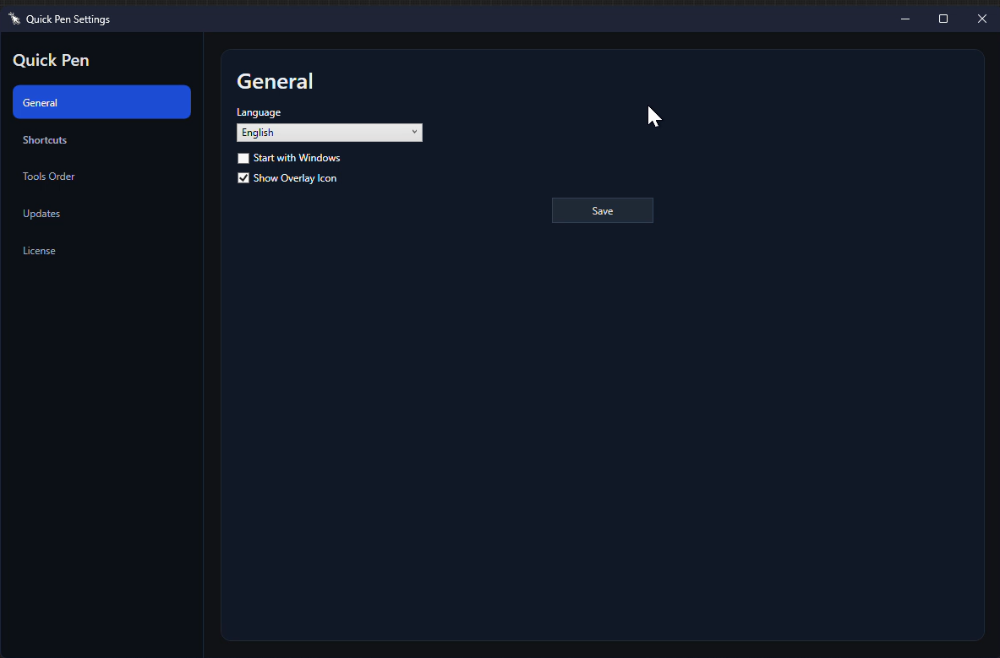

### 10.2 Shortcuts
- Inspect and customize keyboard shortcuts.

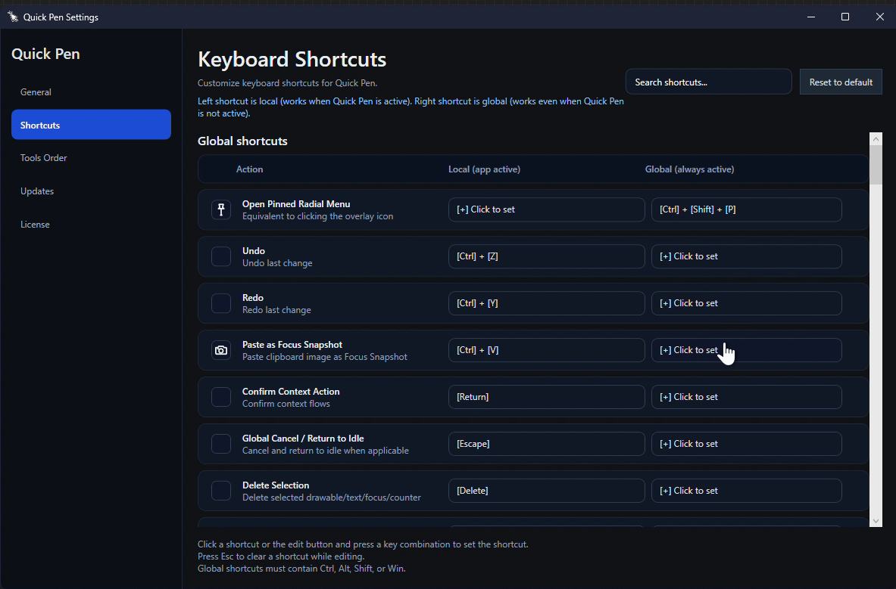

### 10.3 Tools Order
- Reorder the tools in the radial menu to match your workflow.

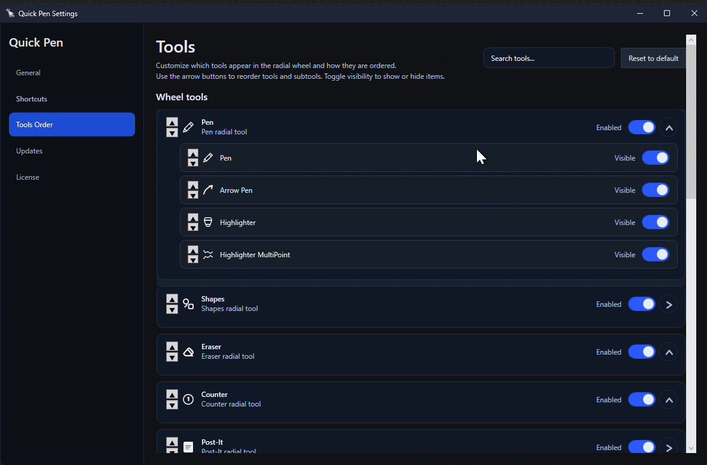

### 10.4 Updates
- Configure update channels and check for new versions. The update dialog is a compact window with the new-version text and `Update` / `See changes` / `Cancel` buttons.

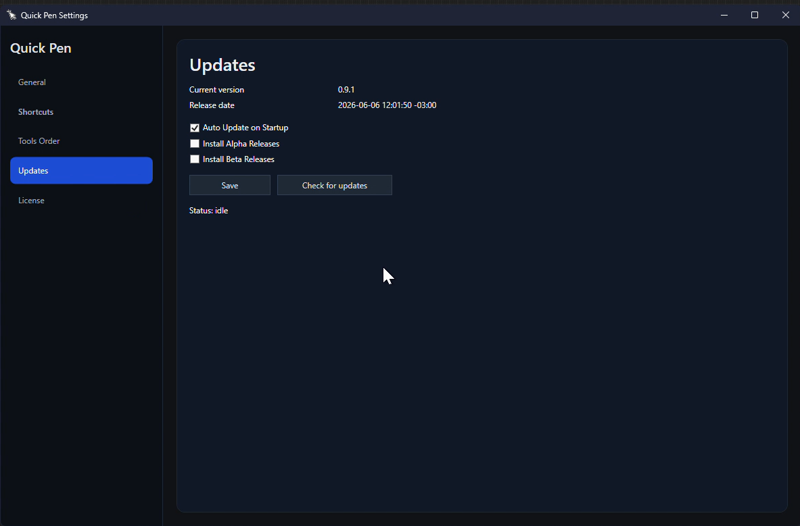

### 10.5 License
- View the current plan and activate / remove a Pro key. Activation contacts the licensing endpoint only to validate the key; license state is stored locally.

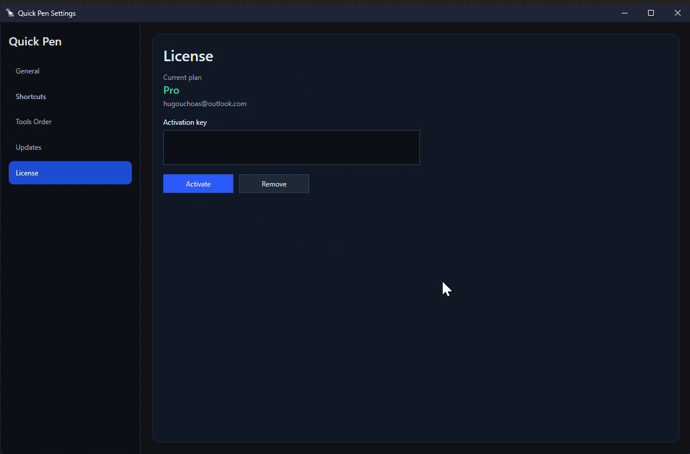

## 11. Keyboard Shortcuts
| Shortcut | Action |
|---|---|
| `Ctrl Ctrl` (double, hold second) | Open radial menu |
| `Esc` | Cancel / leave current context |
| `Ctrl+Z` / `Ctrl+Y` | Undo / Redo |
| `Ctrl+V` | Paste clipboard image as Snapshot |
| `Ctrl+D` | Duplicate selection |
| `Delete` | Remove selection |
| `Ctrl+Shift+1..4` | Zoom levels during video recording |
| `B` / `Shift+B` | Pen / Arrow Pen |
| `H` / `Shift+H` | Highlighter / Highlighter MultiPoint |
| `T` / `L` | Text / Label Text |
| `I` | Counter |
| `P` | Post-it |
| `M` | Move / Pointer |
| `E` | Eraser |
| `A` | Shape Arrow |
| `R` / `Shift+R` | Rectangle / Filled Rectangle |
| `C` / `Shift+C` | Circle / Filled Circle |
| `0`..`5` (top row or numpad) | Lifetime timer (`Off`, `1s`, `2s`, `3s`, `4s`, `5s`) |

Notes:
- With a non-Pointer/Idle tool active, the radial open or during Screenshot mode, QuickPen shortcuts are captured globally — even when a text field in another application has focus. QuickPen's own internal editors preserve their own shortcuts.

## 12. Free vs Pro
Free includes the full set of on-screen drawing tools (Pen, Highlighter, Shapes, Text, Label, Counter, Post-it, Eraser), the radial menu, the tray launcher, undo/redo, selection editing, and the Screenshot capture tool.

Pro unlocks:
- Video and GIF capture.
- Auto-capture timers and saved selection slots.
- Advanced focus tools (Blur, Spotlight, Mask, Zoom).
- Background tool with Z-order control.
- Additional polish and convenience features documented in the in-app License screen.

## 13. Privacy and Security
- QuickPen does not collect user data by default.
- Capture operations only happen when explicitly triggered by you and are written to the destination you select.
- The auto-update check downloads a public release manifest from GitHub; no personal data is sent.

## 14. Troubleshooting
- **Radial does not open:** confirm the second `Ctrl` press happens within ~300ms of the first.
- **Tool stops responding:** press `Esc` to leave the current context, then reopen the radial.
- **Capture image looks empty:** disable Freeze or restart QuickPen and try again.
- **Side launcher is missing:** in `Settings > General`, enable `Show Overlay Icon`, or use the tray menu to reset the launcher position.
- **Update fails:** download the latest installer manually from the releases page and run it; the installer closes the running instance and replaces the files.

## 15. FAQ
### Is QuickPen free?
Yes. Free covers all drawing tools and screenshot capture. Pro adds video/GIF, advanced focus tools and capture conveniences.

### Does QuickPen record continuously?
No. Capture only happens when you start a screenshot, video or GIF session.

### Does QuickPen work with multi-monitor and mixed DPI?
Yes. Overlay, side launcher and capture selection are monitor-aware. The external mask of Screenshot/Video/GIF is reduced during selection adjustment and limited to the active monitor when stopped, preserving fluidity on mixed-DPI setups.

### Where are my preferences saved?
Locally, per Windows user. No account or sync is required for Free.
